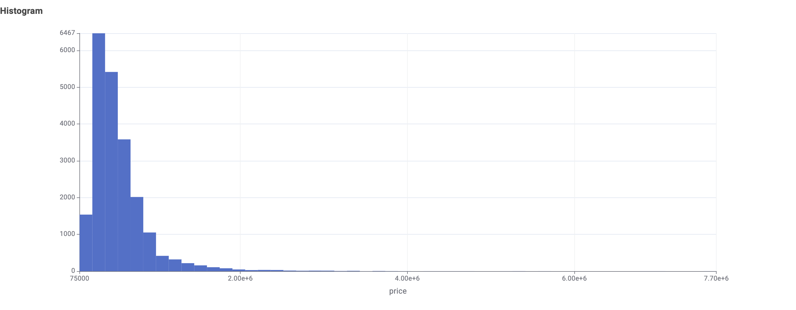
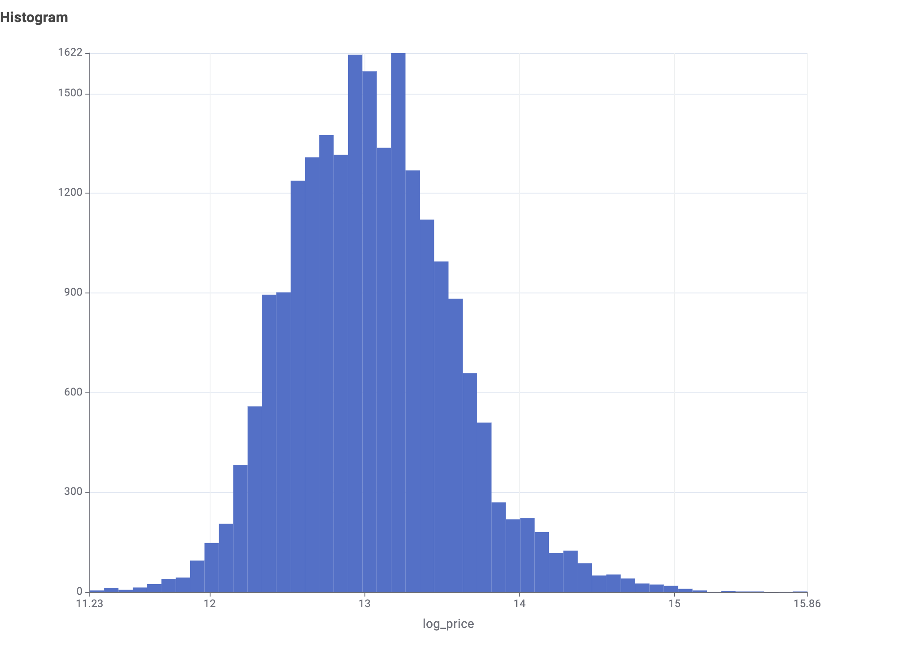
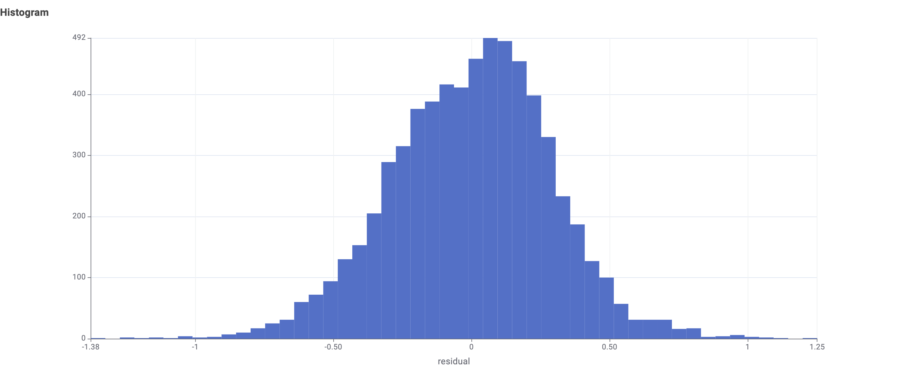

# King County House Price Prediction

Machine Learning Project — University of Milano-Bicocca  
Professor Fabio Stella  
Authors: Amin Entezari, Behtash Kiani  
May 2026

---

## Overview

This project builds a machine learning pipeline to predict residential house prices in King County, Washington State (USA), using the [King County House Sales dataset](https://www.kaggle.com/datasets/harlfoxem/housesalesprediction) — 21,612 transactions recorded between May 2014 and May 2015.

The workflow is implemented entirely in KNIME Analytics Platform and includes preprocessing, regression modelling, dimensionality reduction, cross-validation, and clustering.

---

## Repository Structure

```
Machine-learning-house-price/
├── MachingLearning-AminEntezari.knwf   # KNIME workflow
├── report.pdf                           # Project report
├── data/
│   └── kc_house_data.csv               # Raw dataset
├── plots/
│   ├── Histogram-price.png             # Price distribution
│   ├── Histogram-log-price.png         # Log-price distribution
│   ├── Histogram-res.png               # Residual histogram
│   ├── Scatter Plot-res.png            # Residuals vs predicted
│   └── Scatter Plot-cluster.png        # Geographic cluster map
└── README.md
```

---

## Requirements

- KNIME Analytics Platform 4.7 or higher
- KNIME Machine Learning Extension
- KNIME Statistics Extension
- KNIME Ensembles Extension (Random Forest, Gradient Boosted Trees)

---

## How to Run

1. Clone the repository:

```bash
git clone https://github.com/aminentezari/Machine-learning-house-price.git
```

2. Open KNIME Analytics Platform

3. Import the workflow: File → Import KNIME Workflow → select `MachingLearning-AminEntezari.knwf`

4. Update the CSV Reader node to point to `data/kc_house_data.csv`

5. Right-click the final node and select Execute All

---

## Pipeline

```
CSV Reader
    └── Preprocessing
            Row Filter → Column Filter → Feature Engineering
            → Missing Value → Log Transform → Z-score Normalisation
            → Train/Test Split (70/30)
            
            Regression (holdout)
                Linear Regression      R² = 0.663
                Decision Tree          R² = 0.620
                Random Forest          R² = 0.703
                Gradient Boosted Trees R² = 0.696

            PCA (95% variance, 12 components)
                LR on PCA features     R² = 0.654

            5-Fold Cross-Validation
                LR    RMSE = 0.308
                DT    RMSE = 0.327
                RF    RMSE = 0.286
                GBT   RMSE = 0.296

            K-Means Clustering (K = 2, 3, 4, 5)
                Best K = 2   Silhouette = 0.248
```

---

## Results

### Holdout Test Set

| Model | R² | RMSE | MAE |
|---|---|---|---|
| Random Forest | 0.703 | 0.292 | 0.231 |
| Gradient Boosted Trees | 0.696 | 0.295 | 0.231 |
| Linear Regression | 0.663 | 0.311 | 0.247 |
| LR + PCA (12 components) | 0.654 | 0.315 | 0.229 |
| Decision Tree | 0.620 | 0.330 | 0.260 |

### 5-Fold Cross-Validation

| Model | Avg MSE | Avg RMSE |
|---|---|---|
| Random Forest | 0.0820 | 0.286 |
| Gradient Boosted Trees | 0.0874 | 0.296 |
| Linear Regression | 0.0949 | 0.308 |
| Decision Tree | 0.1070 | 0.327 |

### Clustering

| K | Silhouette |
|---|---|
| 2 | 0.248 |
| 3 | 0.217 |
| 4 | 0.199 |
| 5 | 0.182 |

K = 2 was selected as the optimal number of clusters. Two market segments were identified:

- Cluster 0 (standard market): 13,961 properties, 65% of dataset, below-average price and living space
- Cluster 1 (premium market): 7,651 properties, 35% of dataset, higher price (+0.70 SD), larger living area (+0.94 SD), higher construction grade

---

## Plots

Price and log-price distributions:




Residual analysis (Random Forest):




Geographic cluster map (K = 2):


---

## Key Findings

Random Forest achieved the highest predictive accuracy on both holdout and cross-validation. Living space (sqft_living, sqft_living15), construction grade, and bathroom count are the strongest predictors of house price. Log transformation of the target variable improved model performance by normalising the skewed price distribution. PCA with 12 components retained 95% of variance, achieving comparable but slightly lower accuracy than the full feature set. Clustering revealed a clear geographic separation between premium and standard market segments across King County.

---

## References

Breiman, L. (2001). Random Forests. Machine Learning, 45(1), 5–32.

Friedman, J.H. (2001). Greedy function approximation: A gradient boosting machine. Annals of Statistics, 29(5), 1189–1232.

Wold, S., Esbensen, K., Geladi, P. (1987). Principal component analysis. Chemometrics and Intelligent Laboratory Systems, 2(1-3), 37–52.

MacQueen, J. (1967). Some methods for classification and analysis of multivariate observations. Proc. 5th Berkeley Symposium, 281–297.

---

Amin Entezari — github.com/aminentezari  
University of Milano-Bicocca, Department of Computer Science
